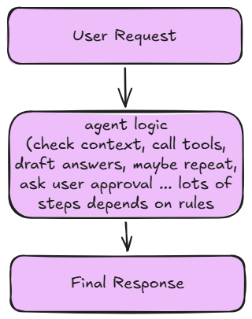

# What is an LLM?

A **Large Language Model (LLM)** is an artificial intelligence system trained to understand and generate human language. It uses machine learning, particularly **deep learning** with neural networks, to process and generate text in a way that mimics human-like understanding and conversation.

---

# How an LLM Works

```text
Internet Data
(Raw text from books, websites, articles, etc.)
                │
                ▼
Pre-processing
(Cleaning, deduplication, formatting)
                │
                ▼
Training
(Model learns patterns through many iterations)
                │
                ▼
Language Model
(Ready to understand and generate text)
```

---

# What is a Token?

In the context of an LLM, a **token** is the basic unit of text that the model processes. In simple terms, tokens are chunks of text, which may be whole words, parts of words, punctuation marks, or even individual characters, depending on the tokenization method.

The process of breaking text into these smaller units is called **tokenization**, and different models use different tokenization methods.

LLMs have a maximum number of tokens they can process in a single request. This limit includes both:

- **Input tokens** (your prompt)
- **Output tokens** (the generated response)

## Tokenization

**Tokenization** is the process of breaking text into smaller units called **tokens**, allowing machines to process and analyze language efficiently.

### Example: Tokenization Using `tiktoken`

```python
import tiktoken

# Load the tokenizer for the GPT-4o model
enc = tiktoken.encoding_for_model("gpt-4o")

# Input text to tokenize
text = "Hey there! My name is Soumadip Majila"

# Convert the text into token IDs
tokens = enc.encode(text)

print(tokens)
# Example Output:
# [25216, 1354, 0, 3673, ....]

# Convert the token IDs back into text
decoded = enc.decode(tokens)

print(decoded)
# Output:
# "Hey there! My name is Soumadip Majila"
```

---

# What is a Context Window in LLMs?

A **context window** refers to the maximum amount of text (measured in **tokens**) that a model can consider at one time while understanding a prompt or generating a response.

In simpler terms, it is the amount of previous information the model can **remember** during a single request.

The context window includes both:

- **Input tokens** (your prompt)
- **Output tokens** (the model's generated response)

For example:

```text
Prompt (2,000 tokens)
          +
Response (500 tokens)
          =
Total Context Used (2,500 tokens)
```

If the total number of tokens exceeds the model's context window, older information may be truncated or ignored, depending on the model and implementation.

---

# AI Fields Overview

| Term                      | Simple Meaning                                                                                                                                                                            | Typical Output                                                       | Easy Example                                                                                    |
| ------------------------- | ----------------------------------------------------------------------------------------------------------------------------------------------------------------------------------------- | -------------------------------------------------------------------- | ----------------------------------------------------------------------------------------------- |
| **Data Science**          | Extracts meaningful insights from data. It analyzes data using Python, SQL, statistics, and visualization tools.                                                                          | Reports, dashboards, trends, predictions                             | "Which product sold the most this month?" or a sales dashboard                                  |
| **Machine Learning (ML)** | A part of AI where computers learn patterns from **historical** data instead of being explicitly programmed with rules.                                                                   | Predictions or classifications                                       | Spam detection, house price prediction, movie recommendations                                   |
| **Deep Learning (DL)**    | A subset of ML that uses **artificial neural networks with many layers** to learn complex patterns. It works well with images, audio, text, and videos.                                   | Image recognition, speech recognition, translation, object detection | Face recognition, speech-to-text, medical image analysis                                        |
| **Generative AI (GenAI)** | A branch of AI based on **deep learning (especially transformer models)** that creates new content such as text, images, code, music, and videos instead of only analyzing existing data. | Newly generated content                                              | ChatGPT writing code, DALL·E generating images, AI music generation                             |
| **Agentic AI**            | AI that can plan, make decisions, use tools, and take **autonomous** actions to complete complex **tasks**.                                                                               | Completed tasks or automated workflows                               | An AI that books a meeting, searches the web, writes a report, and sends an email automatically |

---

# What is an AI Agent?

- **Agent = LLM + Memory + Tools + Rules**
- An AI agent can decide **what to do next** based on the available context.
- The agent still operates under your control and follows the goals and rules you define.

In simple terms, an **AI agent** is an LLM-powered program that can use tools, access memory, and gather context. Based on that context, it decides the next actions to take. These decisions are guided by the rules and goals that you set for the agent.



---

# Chains vs. Agents

- **Chain =** Fixed steps (no decisions involved)
- **Agent =** Chooses the next step dynamically using context.
- Use **chains** first; use **agents** when decision-making or tool usage is required.

## Example of a Chain

```text
Taking user input
        ↓
Add system prompt
        ↓
Call the model
        ↓
Return the answer
```

This flow is fixed and always runs in the same order.

## Example of an Agent

```text
User asks a question
          ↓
Agent analyzes the query
          ↓
Decides whether to:
• Call a search tool
• Use a calculator
• Ask a follow-up question
• Respond directly using the LLM
          ↓
Performs the selected action(s)
          ↓
Returns the final answer
```

Unlike a chain, an agent dynamically decides what to do next based on the current context.

---
