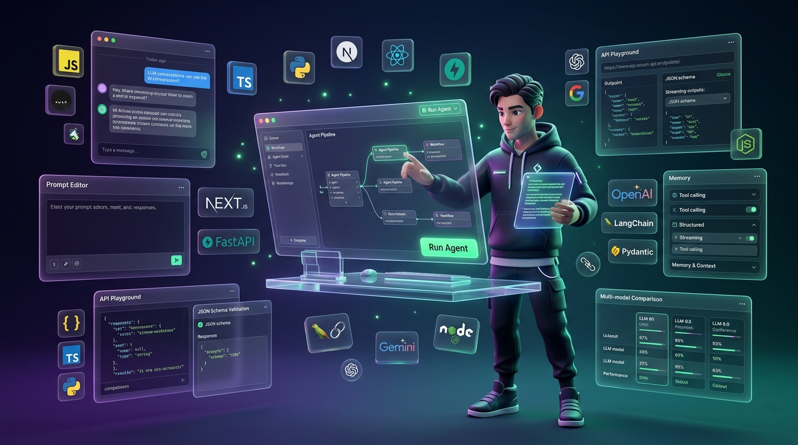

<div align="center">

# GenAI-Playground ✨

<p>
A personal collection of <b>hands-on projects</b>, <b>experiments</b>, and <b>learning notes</b> while exploring the world of Generative AI. 🤖
</p>



</div>

## 🔋 Contents

- 🤖 AI agents and workflows
- 📝 Prompt engineering
- 📄 Structured outputs and JSON schemas
- 🔗 API integrations
- ⚡ FastAPI fundamentals
- 🦜 LangChain and LangGraph
- 🔍 Retrieval-Augmented Generation (RAG)
- 🧠 Embeddings and vector databases
- 🛠️ MCP and AI engineering concepts
- 🚀 Mini AI-powered applications

## 🎯 Purpose

This repository serves as a:

- 📖 Learning journal
- 🧪 Experiment playground
- 🛠️ Collection of practical implementations
- 📈 Progress tracker throughout my GenAI journey

---

## 🐍 Python Development Guide

### 1. Create a virtual environment

```bash
python -m venv venv
```

### 2. Activate the virtual environment

**Linux / macOS**

```bash
source venv/bin/activate
```

**Windows**

```bash
venv\Scripts\activate
```

### 3. Install project dependencies

```bash
pip install -r requirements.txt
```

### 4. Run the development server of the FastAPI application

```bash
uvicorn main:app --reload
```

### 5. Update dependencies (when required)

```bash
pip freeze > requirements.txt
```

---

<div align="center">

> **Learning by building, experimenting, and iterating. 🌱**

</div>
