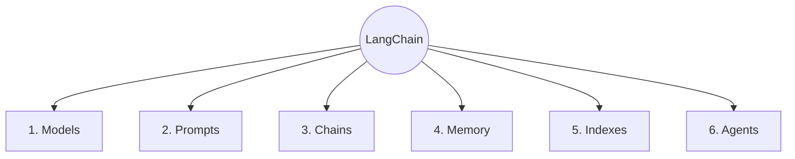
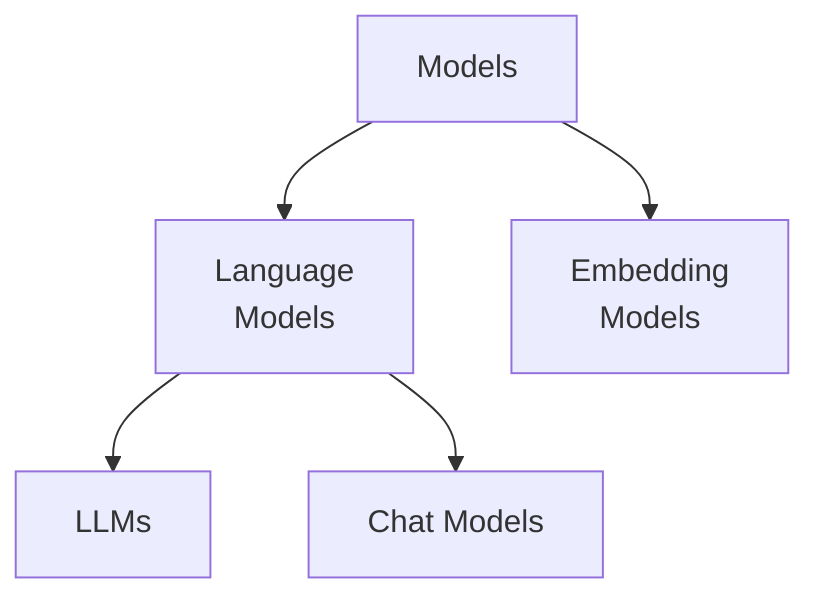
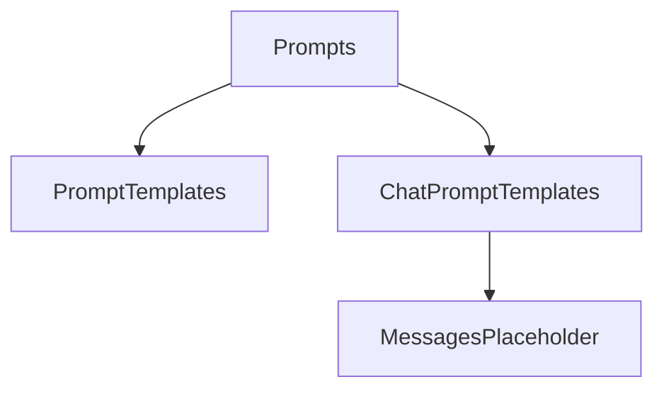
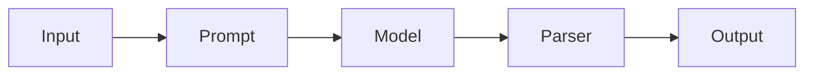
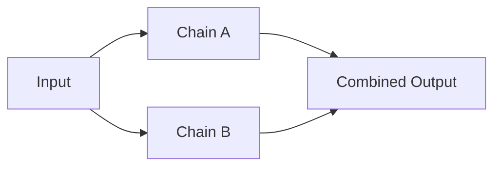
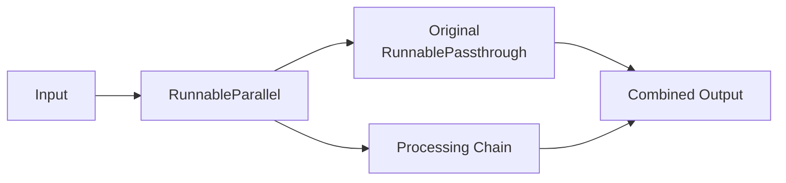
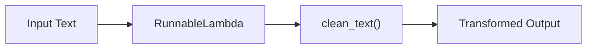
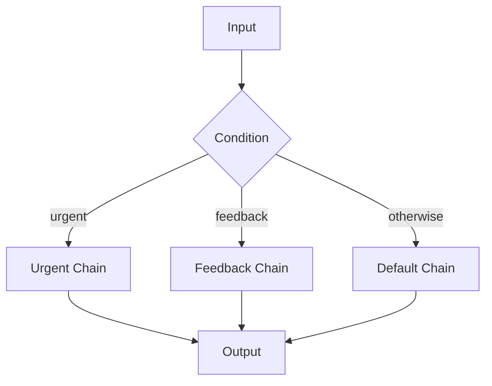

# LangChain

LangChain is an open-source framework for developing applications powered by large language models (LLMs).

## LangChain Components



### 1. Models

In LangChain, models are the core components through which we interact with AI models. LangChain is designed to facilitate interaction with different types of models, including **language models** for text-based applications and **embedding models** that convert text into numerical representations for applications such as **semantic search** and **RAG (Retrieval-Augmented Generation)**.



#### Language Models

Language models are AI systems designed to process, understand, and generate natural language text.

**i. LLMs:**

LLMs are general-purpose language models that typically accept a text prompt as input and generate text as output. They are useful for tasks such as text generation, summarization, and question answering.

> 📁 [`LLM`](../python/03_langchain/01_models/01_llm.py)

**ii. Chat Models:**

Chat models are language models designed to work with conversational messages. They typically accept a sequence of messages, such as system, user, and assistant messages, as input and return a message as output. Modern LLM applications commonly use chat models because they provide a structured interface for conversational interactions.

> 📁 [`Chat Model`](../python/03_langchain/01_models/02_chat_model.py)

#### Embedding Models

Embedding models convert text or other data into numerical vectors called **embeddings**. These vectors capture the semantic meaning of the input and are commonly used for:

- Semantic search
- Similarity search
- Retrieval-Augmented Generation (RAG)
- Recommendation systems
- Document clustering

> 📁 [`Embedding Model`](../python/03_langchain/01_models/03_embedding_model.py)

### 2. Prompts

Prompts are how we provide instructions and context to language models. They guide the model on what task to perform, what context to consider, and how to format its response.

Instead of hardcoding prompt strings, LangChain provides **Prompt Templates** to build dynamic, reusable, and structured inputs using variables, messaging abstractions, and standard formatting.



#### Prompt Templates (`PromptTemplate`)

Standard prompt templates are used to build simple text prompts for standard completion LLMs. They allow you to define a string template with variable placeholders (e.g., `{topic}`) and interpolate values dynamically at runtime.

> 📁 [`Prompt Template`](../python/03_langchain/02_prompts/01_prompt_template.py)

#### Chat Prompt Templates (`ChatPromptTemplate`)

Chat prompt templates are specifically designed for **Chat Models**. They structure inputs into ordered lists of role-based chat messages rather than a single string blob.

Chat prompts typically organize input into three primary message roles:

- **System Message (`system`):** Defines the persona, instructions, system rules, or behavioral constraints for the AI.
- **Human Message (`human`):** Represents the user's input or query.
- **AI Message (`ai`):** Represents responses generated by the model (used when providing few-shot examples or history).

> 📁 [`Chat Prompt Template`](../python/03_langchain/02_prompts/02_chat_prompt_template.py)

#### Messages Placeholder (`MessagesPlaceholder`)

`MessagesPlaceholder` is a specialized wrapper in LangChain used inside a `ChatPromptTemplate` to dynamically inject a variable list of messages (such as ongoing chat history or retrieved state) directly into a specific location within the prompt.

> 📁 [`Messages Placeholder`](../python/03_langchain/02_prompts/03_messages_placeholder.py)

---

> [!IMPORTANT]
>
> ### Structured Output and Output Parsers
>
> LLMs can return responses in different formats. When integrating an LLM with an application, we often need the response in a predictable and structured format.
>
> There are two common approaches:
>
> **1. Models that support structured output**
>
> If the model supports structured output, we can use the `with_structured_output()` method.
>
> Common schema options include:
>
> - **TypedDict:** Provides type hints without runtime data validation. It relies on the LLM to return data that matches the expected structure. 📁 [`TypedDict`](../python/03_langchain/03_output/01_structured_output/01_typed_dict.py)
> - **Pydantic:** Provides data validation and automatic type conversion. It is similar to using **Zod** in TypeScript. 📁 [`Pydantic`](../python/03_langchain/03_output/01_structured_output/02_pydantic.py)
> - **JSON Schema:** Defines the expected JSON structure without requiring an additional Python schema library. 📁 [`JSON Schema`](../python/03_langchain/03_output/01_structured_output/03_json_schema.py)
>
> **2. Models that do not support structured output**
>
> For models that do not natively support structured output, we can use **Output Parsers** to parse the model's response.
>
> Common output parsers include:
>
> - **`StrOutputParser`:** Parses the LLM response as a plain string. 📁 [`String Parser`](../python/03_langchain/03_output/02_output_parsers/01_string_parser.py)
> - **`JsonOutputParser`:** Parses the LLM response as JSON. 📁 [`JSON Parser`](../python/03_langchain/03_output/02_output_parsers/02_json_parser.py)
> - **`PydanticOutputParser`:** Parses the LLM response into a Pydantic model. 📁 [`Pydantic Parser`](../python/03_langchain/03_output/02_output_parsers/03_pydantic_parser.py)

---

### 3. Chains

Chains combine prompts, models, output parsers, and other LangChain components into a single workflow.

They work like a **pipeline**, where the output of one component is passed to the next.

#### Runnables

To make LangChain components easier to combine, LangChain introduced **Runnables** as a common building block for workflows. Components such as **prompts, models, output parsers, and retrievers** can work together as Runnables.

Runnables can also be combined with other Runnables to create different types of workflows, such as **sequential, parallel, conditional, and custom processing flows**.

The most commonly used Runnable primitives are:

**1. RunnableSequence**

`RunnableSequence` executes multiple Runnables **one after another**, passing the output of each step to the next.



For example:

```python
from langchain_core.runnables import RunnableSequence

chain = RunnableSequence(
    prompt,
    model,
    parser
)

result = chain.invoke({"question": "What is AI?"})
```

It is useful for building workflows where each step depends on the result of the previous step.

📁 [`Runnable Sequence`](../python/03_langchain/05_runnables/01_runnable_sequence.py)

---

**2. RunnableParallel**

`RunnableParallel` executes multiple Runnables **independently and concurrently** using the same input. The results are returned together as a dictionary.



For example:

```python
from langchain_core.runnables import RunnableParallel

parallel = RunnableParallel(
    {
        "summary": summary_chain,
        "sentiment": sentiment_chain,
    }
)

result = parallel.invoke({"text": "LangChain is useful for AI applications."})
```

This is useful when multiple independent operations need to be performed on the same input.

📁 [`Runnable Parallel`](../python/03_langchain/05_runnables/02_runnable_parallel.py)

---

**3. RunnablePassthrough**

`RunnablePassthrough` passes the input through **without modifying it**.

It is useful when the original input needs to be preserved while another Runnable processes the same data.



```python
from langchain_core.runnables import RunnableParallel, RunnablePassthrough

chain = RunnableParallel(
    {
        "original": RunnablePassthrough(),
        "processed": processing_chain,
    }
)

result = chain.invoke(input)
```

The output contains both the original input and the processed result.

📁 [`Runnable Passthrough`](../python/03_langchain/05_runnables/03_runnable_passthrough.py)

---

**4. RunnableLambda**

`RunnableLambda` allows you to place a **custom Python function** inside a Runnable pipeline.

It can be used for data transformation, preprocessing, filtering, post-processing, or other custom logic.



```python
from langchain_core.runnables import RunnableLambda

def clean_text(text):
    return text.strip().lower()

cleaner = RunnableLambda(clean_text)
```

The function can then be combined with other Runnables as part of a workflow.

📁 [`Runnable Lambda`](../python/03_langchain/05_runnables/04_runnable_lambda.py)

---

**5. RunnableBranch**

`RunnableBranch` provides **conditional routing**. It evaluates conditions and sends the input to the appropriate Runnable.

It works similarly to an `if / elif / else` structure.



For example:

```python
from langchain_core.runnables import RunnableBranch

branch = RunnableBranch(
    (lambda x: "urgent" in x.lower(), urgent_chain),
    (lambda x: "feedback" in x.lower(), feedback_chain),
    default_chain,
)

result = branch.invoke(user_input)
```

This is useful when different inputs need to follow different processing paths.

📁 [`Runnable Branch`](../python/03_langchain/05_runnables/05_runnable_branch.py)

---

#### LCEL (LangChain Expression Language) & the Pipe Operator

**LCEL (LangChain Expression Language)** is a declarative way to compose LangChain components into **reusable and composable pipelines**.

Instead of manually creating a `RunnableSequence` to connect every step, LCEL allows Runnables to be connected using the **pipe (`|`) operator**.

For example:

```python
chain = prompt | model | parser
```

This creates a sequential workflow:

```text
Prompt → Model → Parser
```

The pipe operator makes chains shorter, easier to read, and easier to compose.

Under the hood, the pipe operator creates a **`RunnableSequence`**.

Therefore, this:

```python
chain = prompt | model | parser
```

is conceptually equivalent to:

```python
chain = RunnableSequence(
    prompt,
    model,
    parser
)
```

📁 [`Simple Chain`](../python/03_langchain/04_chains/01_simple_chain.py)

---
