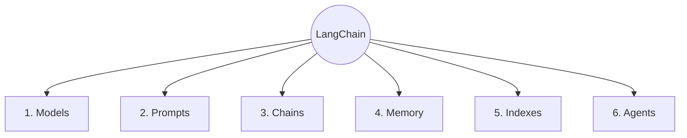
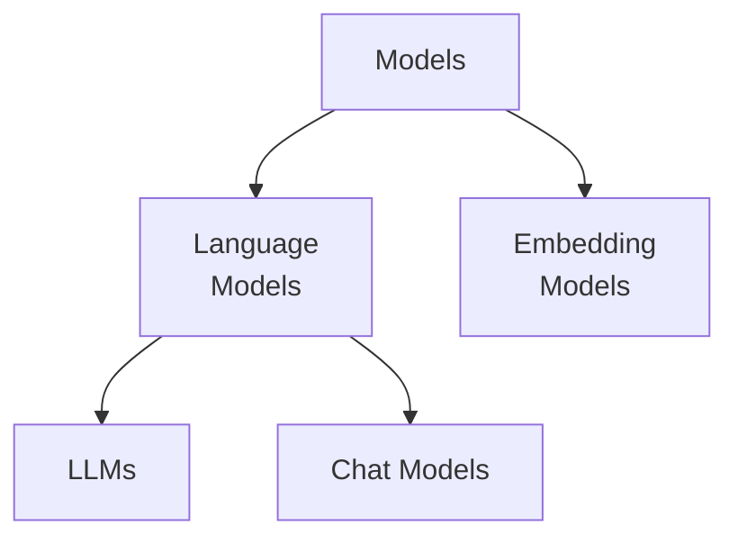
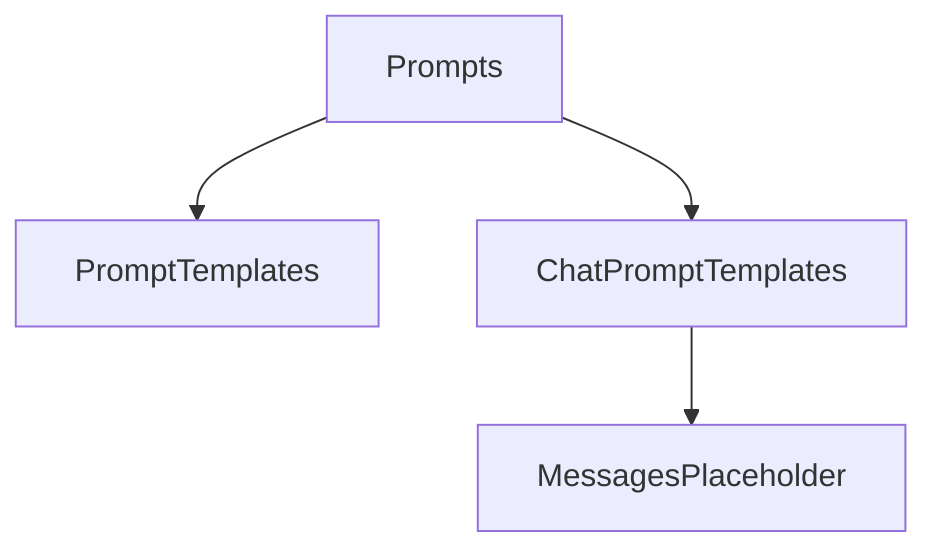

# LangChain

LangChain is an open-source framework for developing applications powered by large language models (LLMs).

## LangChain Components



### 1. Models

In LangChain, models are the core components through which we interact with AI models. LangChain is designed to facilitate interaction with different types of models, including **language models** for text-based applications and **embedding models** that convert text into numerical representations for applications such as **semantic search** and **RAG (Retrieval-Augmented Generation)**.



#### Language Models

Language models are AI systems designed to process, understand, and generate natural language text.

**i. LLMs:**

LLMs are general-purpose language models that typically accept a text prompt as input and generate text as output. They are useful for tasks such as text generation, summarization, and question answering.

> 📁 [`LLM`](../python/03_langchain/01_models/01_llm.py)

**ii. Chat Models:**

Chat models are language models designed to work with conversational messages. They typically accept a sequence of messages, such as system, user, and assistant messages, as input and return a message as output. Modern LLM applications commonly use chat models because they provide a structured interface for conversational interactions.

> 📁 [`Chat Model`](../python/03_langchain/01_models/02_chat_model.py)

#### Embedding Models

Embedding models convert text or other data into numerical vectors called **embeddings**. These vectors capture the semantic meaning of the input and are commonly used for:

- Semantic search
- Similarity search
- Retrieval-Augmented Generation (RAG)
- Recommendation systems
- Document clustering

> 📁 [`Embedding Model`](../python/03_langchain/01_models/03_embedding_model.py)

### 2. Prompts

Prompts are how we provide instructions and context to language models. They guide the model on what task to perform, what context to consider, and how to format its response.

Instead of hardcoding prompt strings, LangChain provides **Prompt Templates** to build dynamic, reusable, and structured inputs using variables, messaging abstractions, and standard formatting.



#### Prompt Templates (`PromptTemplate`)

Standard prompt templates are used to build simple text prompts for standard completion LLMs. They allow you to define a string template with variable placeholders (e.g., `{topic}`) and interpolate values dynamically at runtime.

> 📁 [`Prompt Template`](../python/03_langchain/02_prompts/01_prompt_template.py)

#### Chat Prompt Templates (`ChatPromptTemplate`)

Chat prompt templates are specifically designed for **Chat Models**. They structure inputs into ordered lists of role-based chat messages rather than a single string blob.

Chat prompts typically organize input into three primary message roles:

- **System Message (`system`):** Defines the persona, instructions, system rules, or behavioral constraints for the AI.
- **Human Message (`human`):** Represents the user's input or query.
- **AI Message (`ai`):** Represents responses generated by the model (used when providing few-shot examples or history).

> 📁 [`Chat Prompt Template`](../python/03_langchain/02_prompts/02_chat_prompt_template.py)

#### Messages Placeholder (`MessagesPlaceholder`)

`MessagesPlaceholder` is a specialized wrapper in LangChain used inside a `ChatPromptTemplate` to dynamically inject a variable list of messages (such as ongoing chat history or retrieved state) directly into a specific location within the prompt.

> 📁 [`Messages Placeholder`](../python/03_langchain/02_prompts/03_messages_placeholder.py)

---

> [!IMPORTANT]
>
> ### Structured Output and Output Parsers
>
> LLMs can return responses in different formats. When integrating an LLM with an application, we often need the response in a predictable and structured format.
>
> There are two common approaches:
>
> **1. Models that support structured output**
>
> If the model supports structured output, we can use the `with_structured_output()` method.
>
> Common schema options include:
>
> - **TypedDict:** Provides type hints without runtime data validation. It relies on the LLM to return data that matches the expected structure. 📁 [`TypedDict`](../python/03_langchain/03_output/01_structured_output/01_typed_dict.py)
> - **Pydantic:** Provides data validation and automatic type conversion. It is similar to using **Zod** in TypeScript. 📁 [`Pydantic`](../python/03_langchain/03_output/01_structured_output/02_pydantic.py)
> - **JSON Schema:** Defines the expected JSON structure without requiring an additional Python schema library. 📁 [`JSON Schema`](../python/03_langchain/03_output/01_structured_output/03_json_schema.py)
>
> **2. Models that do not support structured output**
>
> For models that do not natively support structured output, we can use **Output Parsers** to parse the model's response.
>
> Common output parsers include:
>
> - **`StrOutputParser`:** Parses the LLM response as a plain string. 📁 [`String Parser`](../python/03_langchain/03_output/02_output_parsers/01_string_parser.py)
> - **`JsonOutputParser`:** Parses the LLM response as JSON. 📁 [`JSON Parser`](../python/03_langchain/03_output/02_output_parsers/02_json_parser.py)
> - **`PydanticOutputParser`:** Parses the LLM response into a Pydantic model. 📁 [`Pydantic Parser`](../python/03_langchain/03_output/02_output_parsers/03_pydantic_parser.py)

---

### 3. Chains

Chains combine prompts, models, output parsers, and other LangChain components into a single workflow.

They work like a **pipeline**, where the output of one component is passed to the next.

#### LCEL (LangChain Expression Language)

**LCEL (LangChain Expression Language)** is a declarative way to compose LangChain components into **reusable and composable pipelines**.

Instead of manually calling each component and passing its output to the next component, LCEL allows components to be connected using the pipe (`|`) operator.

#### Chain Types

**1. Simple Chain**

A simple chain represents a straightforward linear pipeline where components execute in a fixed order.

```text
Input → Prompt → LLM → Output Parser → Output
```

> 📁 [`Simple Chain`](../python/03_langchain/04_chains/01_simple_chain.py)

**2. Sequential Chain**

A sequential chain consists of multiple steps executed one after another. The output from an earlier step is passed to the next step as its input.

```text
Input
  ↓
Prompt → LLM → Parser
  ↓
Next Prompt → LLM → Parser
  ↓
Final Output
```

This is useful when a task naturally consists of multiple dependent stages, such as **generate → summarize**.

> 📁 [`Sequential Chain`](../python/03_langchain/04_chains/02_sequential_chain.py)

**3. Parallel Chain**

A parallel chain executes multiple independent operations using the same input concurrently. In LCEL, `RunnableParallel` is used to run multiple runnables in parallel and collect their results into a single output.

```text
                 ┌──→ Chain A ──┐
Input ───────────┤              ├──→ Next Step
                 └──→ Chain B ──┘
```

This is useful when multiple pieces of information can be generated independently, such as creating **study notes and a quiz** from the same document.

> 📁 [`Parallel Chain`](../python/03_langchain/04_chains/03_parallel_chain.py)

**4. Conditional Chain**

A conditional chain selects which component or chain to execute based on a condition.

```text
Input
  ↓
Classification / Condition
  ↓
┌───────────────┬───────────────┐
│ Condition A   │ Condition B   │
↓               ↓               │
│ Chain A       │ Chain B       │
└───────────────┴───────────────┘
          ↓
      Final Output
```

This is useful when different inputs require different processing paths,LangChain provides `RunnableBranch` for implementing conditional routing and `RunnableLambda` for custom Python logic within a runnable pipeline.

> 📁 [`Conditional Chain`](../python/03_langchain/04_chains/04_conditional_chain.py)

---

### 4. Memory

LLM API calls are stateless. Therefore, we need to store the state of a conversation to maintain context across interactions. This is where memory comes in.

Frequently used types of memory:

- **ConversationBufferMemory:** Stores a transcript of the conversation. It is useful for short conversations but can grow large quickly.

- **ConversationBufferWindowMemory:** Keeps only the last N interactions to avoid excessive token usage.

- **Custom Memory:** For advanced use cases, you can store specialized state, such as user preferences or important facts, in a custom memory class.

### 5. Indexes

Indexes connect your application to external knowledge sources, such as PDFs, websites, or databases.

They typically involve four components:

- **Document Loader**
- **Text Splitter**
- **Vector Store**
- **Retriever**

### 6. Agents

Agents use a language model to decide which actions or tools to use to accomplish a given task. They can dynamically determine the steps required instead of following a fixed sequence.

```

```
