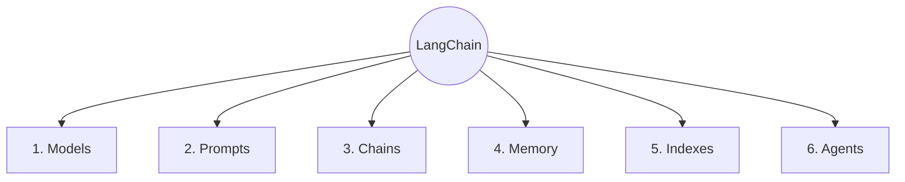
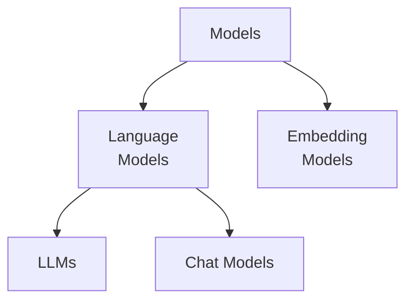

# LangChain

LangChain is an open-source framework for developing applications powered by large language models (LLMs).

## LangChain Components

### 1. Models

In LangChain, models are the core components through which we interact with AI models. LangChain is designed to facilitate interaction with different types of models, including **language models** for text-based applications and **embedding models** that convert text into numerical representations for applications such as **semantic search** and **RAG (Retrieval-Augmented Generation)**.

#### Language Models

Language models are AI systems designed to process, understand, and generate natural language text.

**i. LLMs:**

LLMs are general-purpose language models that typically accept a text prompt as input and generate text as output. They are useful for tasks such as text generation, summarization, and question answering.

> 📁 **Reference File:** [`LLM`](../python/03_langchain/01_models/01_llm.py)

**ii. Chat Models:**

Chat models are language models designed to work with conversational messages. They typically accept a sequence of messages, such as system, user, and assistant messages, as input and return a message as output. Modern LLM applications commonly use chat models because they provide a structured interface for conversational interactions.

> 📁 **Reference File:** [`Chat Model`](../python/03_langchain/01_models/02_chat_model.py)

#### Embedding Models

Embedding models convert text or other data into numerical vectors called **embeddings**. These vectors capture the semantic meaning of the input and are commonly used for:

- Semantic search
- Similarity search
- Retrieval-Augmented Generation (RAG)
- Recommendation systems
- Document clustering

> 📁 **Reference File:** [`Embedding Model`](../python/03_langchain/01_models/03_embedding_model.py)

### 2. Prompts

Prompts are how we provide instructions and input to models. They guide the model on what to do, what information to consider, and how to structure its response.

### 3. Chains

Chains allow us to combine models, prompts, and other components to create a cohesive flow of interactions. They act as pipelines that define how different components work together.

### 4. Memory

LLM API calls are stateless. Therefore, we need to store the state of a conversation to maintain context across interactions. This is where memory comes in.

Frequently used types of memory:

- **ConversationBufferMemory:** Stores a transcript of the conversation. It is useful for short conversations but can grow large quickly.

- **ConversationBufferWindowMemory:** Keeps only the last N interactions to avoid excessive token usage.

- **Custom Memory:** For advanced use cases, you can store specialized state, such as user preferences or important facts, in a custom memory class.

### 5. Indexes

Indexes connect your application to external knowledge sources, such as PDFs, websites, or databases.

They typically involve four components:

- **Document Loader**
- **Text Splitter**
- **Vector Store**
- **Retriever**

### 6. Agents

Agents use a language model to decide which actions or tools to use to accomplish a given task. They can dynamically determine the steps required instead of following a fixed sequence.
