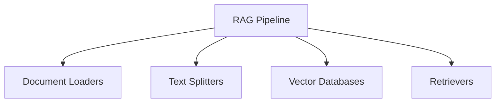
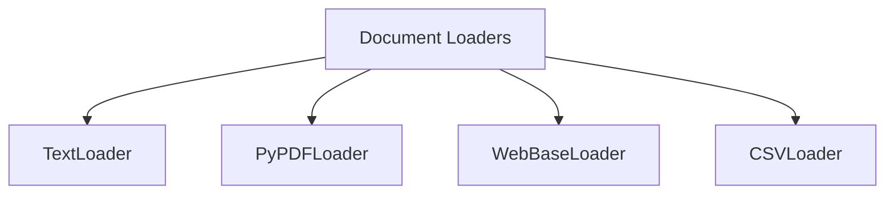
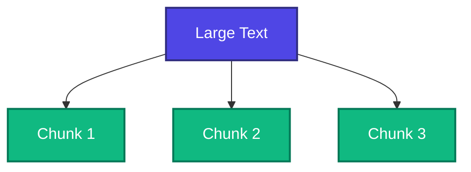
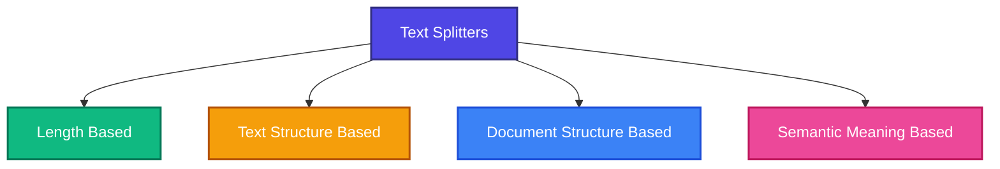
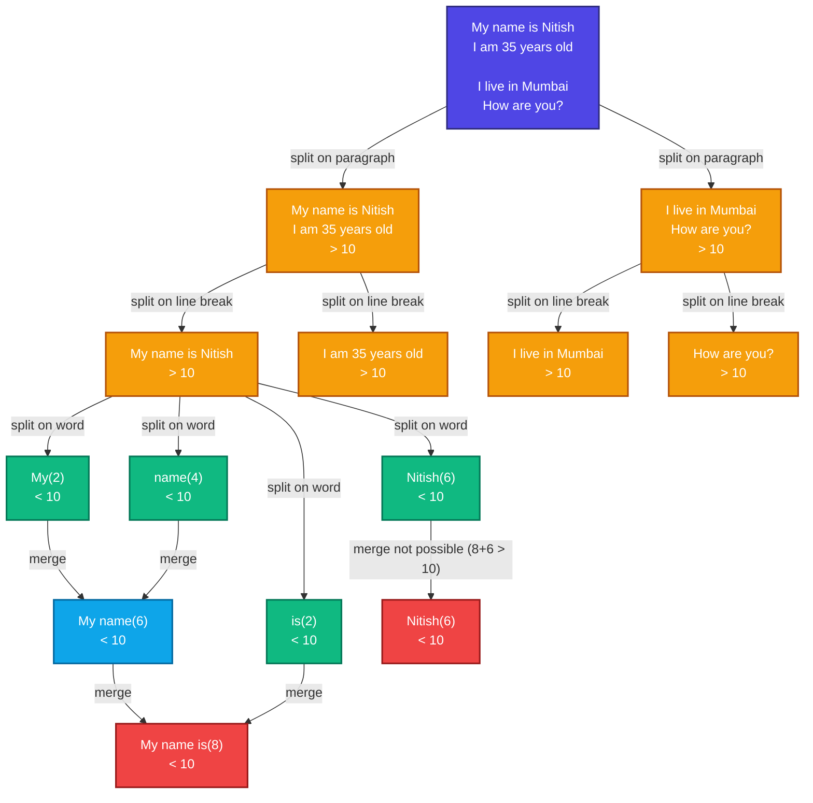

# Retrieval-Augmented Generation (RAG)

Retrieval-Augmented Generation (RAG) is a technique that combines information retrieval with language generation. A model retrieves relevant documents from a knowledge base and uses them as context to generate accurate, grounded, and context-aware responses.

## Benefits of Using RAG

1. Use of up-to-date information.
2. Better privacy
3. No limit of document size

## Components of RAG



### Document Loaders

Document Loaders are components in LangChain that load data from different sources and convert it into a standardized `Document` format.

These documents can then be used for text splitting, embedding, retrieval, and generation.

```text
Document(
    page_content="The actual text content",
    metadata={"source": "filename.pdf", ...}
)
```

**Common document loaders include:**



#### TextLoader

**TextLoader** is a simple and commonly used document loader in LangChain that reads plain-text `.txt` files and converts them into `Document` objects.

**Use case:** Ideal for loading chat logs, scraped text, transcripts, code snippets, or any plain-text data into a LangChain pipeline.

**Limitation:** Works only with `.txt` files.

#### PyPDFLoader

**PyPDFLoader** is a document loader in LangChain used to load content from PDF files and convert each page into a `Document` object.

```text
[
    Document(
        page_content="Text from page 1",
        metadata={"page": 0, "source": "file.pdf"}
    ),
    Document(
        page_content="Text from page 2",
        metadata={"page": 1, "source": "file.pdf"}
    ),
    ...
]
```

**Limitation:** It uses the `pypdf` library under the hood and is not ideal for scanned PDFs or complex layouts.

| Use Case                           | Recommended Loader                                   |
| ---------------------------------- | ---------------------------------------------------- |
| Simple, clean PDF                  | `PyPDFLoader`                                        |
| PDFs with tables/columns           | `PDFPlumberLoader`                                   |
| Scanned/image PDFs                 | `UnstructuredPDFLoader` or `AmazonTextractPDFLoader` |
| Need layout and image data         | `PyMuPDFLoader`                                      |
| Want the best structure extraction | `UnstructuredPDFLoader`                              |

#### DirectoryLoader

**DirectoryLoader** is a document loader that lets you load multiple documents from a directory (folder) of files.

| Glob Pattern   | What It Loads                          |
| -------------- | -------------------------------------- |
| `"**/*.txt"`   | All `.txt` files in all subfolders     |
| `"*.pdf"`      | All `.pdf` files in the root directory |
| `"data/*.csv"` | All `.csv` files in the `data/` folder |
| `"**/*"`       | All files of any type in all folders   |

`**` = recursive search through subfolders.

> [!IMPORTANT]
>
> **Load vs Lazy Load**
>
> ### `load()`
>
> - **Eager Loading** (loads everything at once).
> - Returns a **list of `Document` objects**.
> - Loads all documents immediately into memory.
> - **Best when:**
>   - The number of documents is small.
>   - You want everything loaded upfront.
>
> ### `lazy_load()`
>
> - **Lazy Loading** (loads on demand).
> - Returns a **generator of `Document` objects**.
> - Documents are not all loaded at once; they're fetched one at a time as needed.
> - **Best when:**
>   - You're dealing with large documents or lots of files.
>   - You want to stream processing (e.g., chunking, embedding) without using lots of memory.

#### WebBaseLoader

**WebBaseLoader** is a document loader in LangChain used to load and extract text content from web pages (URLs).

It uses **BeautifulSoup** under the hood to parse HTML and extract visible text.

**When to Use:**

- For blogs, news articles, or public websites where the content is primarily text-based and static.

**Limitations:**

- Doesn't handle JavaScript-heavy pages well (use `SeleniumURLLoader` for that).
- Loads only static content (what's in the HTML, not what loads after the page renders).

---

### Text Splitters

Text splitting is the process of breaking large bodies of text (such as articles, PDFs, HTML pages, or books) into smaller, manageable pieces called **chunks** that an LLM can handle effectively.



**Why split text?**

- **Overcoming model limitations:** Many embedding models and language models have a maximum input size. Splitting allows us to process documents that would otherwise exceed these limits.

- **Improving downstream tasks:** Text splitting improves nearly every LLM-powered task.

| Task                | Why splitting helps                      |
| :------------------ | :--------------------------------------- |
| **Embedding**       | Short chunks yield more accurate vectors |
| **Semantic search** | Results point to focused info, not noise |
| **Summarization**   | Prevents hallucination and topic drift   |

- **Optimizing computational resources:** Smaller chunks are more memory-efficient and allow better parallelization of processing tasks.

**Types of text splitters**



#### Length Based

Splits text based on a specified length, such as the number of **characters, tokens, or words**.

It is the simplest and fastest approach, but it is unaware of meaning or structure, so a chunk may end in the middle of a sentence.

📁 [Length Based](../python/04_rag/text_splitters/01_length_based.py)

#### Text Structure Based

Splits text based on the natural structure of the text, using separators such as:

- `"\n\n"` → paragraph
- `"\n"` → line break
- `" "` → word
- `""` → character

The splitter applies these separators **hierarchically**. It first tries the paragraph separator; if a resulting piece is still larger than the allowed chunk size, it tries the line-break separator, then the word separator, and finally the character separator. Adjacent small pieces are then merged back together as long as the combined size stays within the chunk limit.

For example, suppose the text is:

```text
My name is Nitish
I am 35 years old

I live in Mumbai
How are you?
```

and the **allowed chunk size is 10**.



📁 [Text Structure Based](../python/04_rag/text_splitters/02_text_structured_based.py)

#### Document Structure Based

An extension of `RecursiveCharacterTextSplitter` (text-structure-based splitting) that swaps the generic separators for ones that match the syntax of a particular document type or programming language.

- **Markdown:** splits on headings (`\n# `, `\n## `, `\n### `), code fences, horizontal rules, and list items, so each chunk maps to a logical section.
- **Python:** splits on `\nclass `, `\ndef `, `\n\tdef `, and then on blank lines, so a class or function stays intact instead of being cut halfway through its body.

The benefit is that chunks align with meaningful units of the document, which makes retrieval results far easier for an LLM to interpret.

📁 [Markdown Splitting](../python/04_rag/text_splitters/03_document_structure_based/markdown_splitting.py)

📁 [Python Code Splitting](../python/04_rag/text_splitters/03_document_structure_based/python_code_splitting.py)

#### Semantic Meaning Based

Splits text according to **meaning** rather than length or structure. The text is first divided into sentences, each sentence is embedded, and the similarity between consecutive embeddings is compared. When the similarity drops sharply — signalling a change of topic — a chunk boundary is created at that point.

This produces topically coherent chunks, but it is slower and more expensive than the other methods because every sentence has to be embedded. In LangChain it is provided by `SemanticChunker`, which is still **experimental**.

---

### Vector Stores

A **Vector Store** is a system used to **store and search numerical vectors**.

Vectors are usually created from text, images, or other data using an **embedding model**.

### Key Features

1. **Storage** → Stores vectors along with their related information (metadata).
2. **Similarity Search** → Finds vectors that are most similar to a given query.
3. **Indexing** → Makes searching through a large number of vectors faster.
4. **CRUD Operations** → Allows you to **Add, Read, Update, and Delete** vectors.

### Use Cases

1. **Semantic Search** → Find results based on meaning, not just keywords.
2. **RAG** → Store document embeddings and retrieve relevant information for an LLM.
3. **Recommendation Systems** → Find similar products, users, movies, etc.
4. **Image/Multimedia Search** → Find images, audio, or videos that are similar to a query.

### Vector Store vs Vector Database

**Vector Store** is a general term for a system that stores and searches vectors.

**Vector Database** is a more complete database system specifically designed to store, index, and search vectors at scale.

**Simple way to remember:**

> **Vector Store = Store and search vectors**
> **Vector Database = Full database system built for vectors**

---
