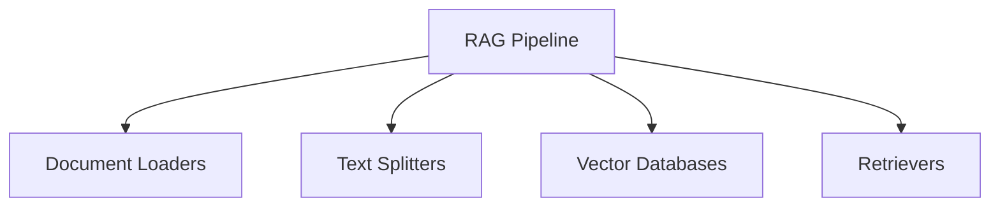
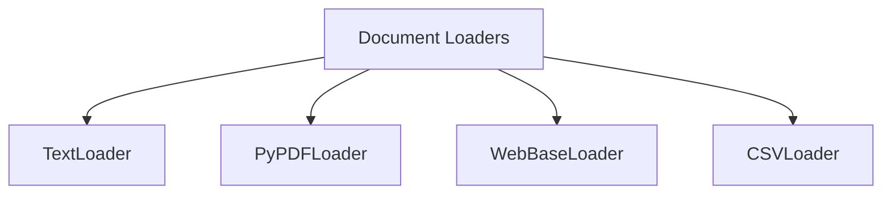

# Retrieval-Augmented Generation (RAG)

Retrieval-Augmented Generation (RAG) is a technique that combines information retrieval with language generation. A model retrieves relevant documents from a knowledge base and uses them as context to generate accurate, grounded, and context-aware responses.

## Benefits of Using RAG

1. Use of up-to-date information.
2. Better privacy
3. No limit of document size

## Components of RAG



### Document Loaders

Document Loaders are components in LangChain that load data from different sources and convert it into a standardized `Document` format.

These documents can then be used for text splitting, embedding, retrieval, and generation.

```text
Document(
    page_content="The actual text content",
    metadata={"source": "filename.pdf", ...}
)
```

**Common document loaders include:**



#### TextLoader

**TextLoader** is a simple and commonly used document loader in LangChain that reads plain-text `.txt` files and converts them into `Document` objects.

**Use case:** Ideal for loading chat logs, scraped text, transcripts, code snippets, or any plain-text data into a LangChain pipeline.

**Limitation:** Works only with `.txt` files.

#### PyPDFLoader

**PyPDFLoader** is a document loader in LangChain used to load content from PDF files and convert each page into a `Document` object.

```text
[
    Document(
        page_content="Text from page 1",
        metadata={"page": 0, "source": "file.pdf"}
    ),
    Document(
        page_content="Text from page 2",
        metadata={"page": 1, "source": "file.pdf"}
    ),
    ...
]
```

**Limitation:** It uses the `pypdf` library under the hood and is not ideal for scanned PDFs or complex layouts.

| Use Case                           | Recommended Loader                                   |
| ---------------------------------- | ---------------------------------------------------- |
| Simple, clean PDF                  | `PyPDFLoader`                                        |
| PDFs with tables/columns           | `PDFPlumberLoader`                                   |
| Scanned/image PDFs                 | `UnstructuredPDFLoader` or `AmazonTextractPDFLoader` |
| Need layout and image data         | `PyMuPDFLoader`                                      |
| Want the best structure extraction | `UnstructuredPDFLoader`                              |

#### DirectoryLoader

**DirectoryLoader** is a document loader that lets you load multiple documents from a directory (folder) of files.

| Glob Pattern   | What It Loads                          |
| -------------- | -------------------------------------- |
| `"**/*.txt"`   | All `.txt` files in all subfolders     |
| `"*.pdf"`      | All `.pdf` files in the root directory |
| `"data/*.csv"` | All `.csv` files in the `data/` folder |
| `"**/*"`       | All files of any type in all folders   |

`**` = recursive search through subfolders.
