# Retrieval-Augmented Generation (RAG)

Retrieval-Augmented Generation (RAG) is a technique that combines **information retrieval** with **language generation**.

A RAG system retrieves relevant documents from a knowledge base and provides them as context to a Large Language Model (LLM). The LLM then uses this context to generate accurate, grounded, and context-aware responses.

## Benefits of Using RAG

1. Use of up-to-date information.
2. Better privacy
3. No limit of document size

---

# Components of RAG

A typical RAG pipeline consists of:

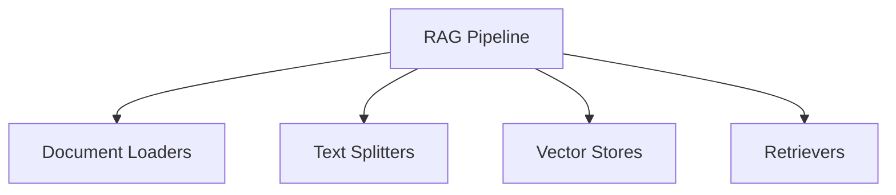

---

# Document Loaders

Document Loaders are components in LangChain that load data from different sources and convert the data into a standardized `Document` format.

The resulting documents can then be used for:

- Text splitting
- Embedding
- Retrieval
- Generation

A LangChain `Document` generally contains the actual text and associated metadata.

```text
Document(
    page_content="The actual text content",
    metadata={"source": "filename.pdf", ...}
)
```

## Common Document Loaders

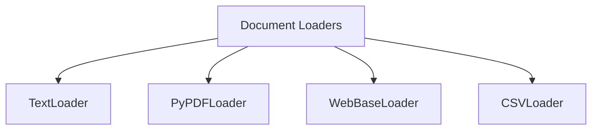

---

## TextLoader

**TextLoader** is a simple and commonly used document loader in LangChain that reads plain-text `.txt` files and converts them into `Document` objects.

**Use case:** Ideal for loading chat logs, scraped text, transcripts, code snippets, or any plain-text data into a LangChain pipeline.

**Limitation:** Works only with `.txt` files.

---

## PyPDFLoader

**PyPDFLoader** is a document loader in LangChain used to load content from PDF files and convert each page into a `Document` object.

```text
[
    Document(
        page_content="Text from page 1",
        metadata={"page": 0, "source": "file.pdf"}
    ),
    Document(
        page_content="Text from page 2",
        metadata={"page": 1, "source": "file.pdf"}
    ),
    ...
]
```

**Limitation:** It uses the `pypdf` library under the hood and is not ideal for scanned PDFs or complex layouts.

### Choosing a PDF Loader

| Use Case                   | Recommended Loader                                   |
| -------------------------- | ---------------------------------------------------- |
| Simple, clean PDF          | `PyPDFLoader`                                        |
| PDFs with tables/columns   | `PDFPlumberLoader`                                   |
| Scanned/image PDFs         | `UnstructuredPDFLoader` or `AmazonTextractPDFLoader` |
| Need layout and image data | `PyMuPDFLoader`                                      |
| Best structure extraction  | `UnstructuredPDFLoader`                              |

---

## DirectoryLoader

**DirectoryLoader** allows you to load multiple documents from a directory.

It can use glob patterns to determine which files should be loaded.

| Glob Pattern   | What It Loads                          |
| -------------- | -------------------------------------- |
| `"**/*.txt"`   | All `.txt` files in all subfolders     |
| `"*.pdf"`      | All `.pdf` files in the root directory |
| `"data/*.csv"` | All `.csv` files in the `data/` folder |
| `"**/*"`       | All files of any type in all folders   |

> `**` means recursive search through subfolders.

---

## `load()` vs `lazy_load()`

### `load()`

`load()` performs **eager loading**.

- Loads everything at once.
- Returns a list of `Document` objects.
- Loads all documents immediately into memory.

Best when:

- The number of documents is small.
- You want everything loaded upfront.

### `lazy_load()`

`lazy_load()` performs **lazy loading**.

- Loads documents on demand.
- Returns a generator of `Document` objects.
- Documents are fetched one at a time as needed.

Best when:

- Working with large documents.
- Working with many files.
- You want to stream processing such as chunking or embedding.
- You want to reduce memory usage.

---

## WebBaseLoader

**WebBaseLoader** is a LangChain document loader used to load and extract text content from web pages.

It uses **BeautifulSoup** to parse HTML and extract visible text.

### When to Use

It is useful for:

- Blogs
- News articles
- Public websites
- Static text-based web pages

### Limitations

- Does not handle JavaScript-heavy pages well.
- Loads static HTML content rather than content generated after the page renders.

For JavaScript-heavy pages, a browser-based loader such as `SeleniumURLLoader` may be more appropriate.

---

# Text Splitters

Text splitting is the process of breaking large bodies of text into smaller, manageable pieces called **chunks**.

Documents such as:

- Articles
- PDFs
- HTML pages
- Books

can be too large to process effectively as a single piece.

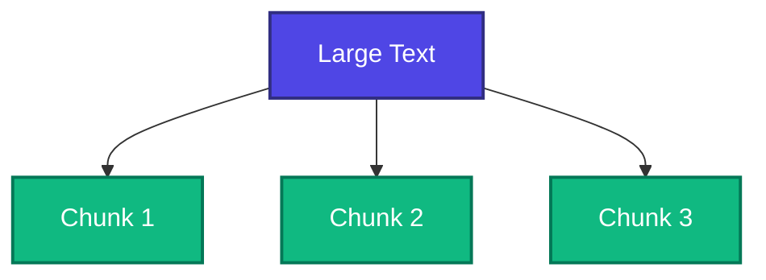

---

# Types of Text Splitters

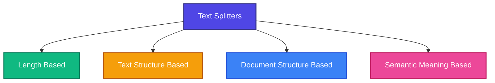

---

## 1. Length-Based Splitting

Splits text based on a specified length, such as the number of **characters, tokens, or words**.

It is the simplest and fastest approach, but it is unaware of meaning or structure, so a chunk may end in the middle of a sentence.

📁 [Length Based](../python/04_rag/text_splitters/01_length_based.py)

---

## 2. Text Structure-Based Splitting

Text structure-based splitting uses natural separators in the text.

Common separators:

```text
"\n\n" → Paragraph
"\n"   → Line
" "    → Word
""     → Character
```

It usually works **hierarchically**:

1. Split by paragraphs.
2. If a chunk is too large, split by lines.
3. Then split by words.
4. Finally, split by characters.
5. Merge small pieces until the chunk size limit is reached.

📁 [Text Structure Based](../python/04_rag/text_splitters/02_text_structured_based.py)

---

# 3. Document Structure-Based Splitting

Document structure-based splitting uses separators specific to the document type or programming language.

This keeps chunks aligned with meaningful parts of the document.

### Markdown

Markdown can be split using:

- `#`, `##`, `###` headings
- Code blocks
- Horizontal rules
- Lists

This helps keep related content together.

### Python

Python code can be split using:

```text
class
def
```

This helps keep classes and functions together instead of splitting them in the middle.

### Benefit

Chunks are more meaningful and easier for an LLM to understand and retrieve.

📁 [Markdown Splitting](../python/04_rag/text_splitters/03_document_structure_based/markdown_splitting.py)

📁 [Python Code Splitting](../python/04_rag/text_splitters/03_document_structure_based/python_code_splitting.py)

---

# 4. Semantic Meaning-Based Splitting

Splits text according to **meaning** rather than length or structure. The text is first divided into sentences, each sentence is embedded, and the similarity between consecutive embeddings is compared. When the similarity drops sharply — signalling a change of topic — a chunk boundary is created at that point.

This produces topically coherent chunks, but it is slower and more expensive than the other methods because every sentence has to be embedded. In LangChain it is provided by `SemanticChunker`, which is still **experimental**.

---

# Vector Stores

A **Vector Store** is a system used to **store and search numerical vectors**.

Vectors are usually created from text, images, or other data using an **embedding model**.

### Key Features

1. **Storage** → Stores vectors along with their related information (metadata).
2. **Similarity Search** → Finds vectors that are most similar to a given query.
3. **Indexing** → Makes searching through a large number of vectors faster.
4. **CRUD Operations** → Allows you to **Add, Read, Update, and Delete** vectors.

### Use Cases

1. **Semantic Search** → Find results based on meaning, not just keywords.
2. **RAG** → Store document embeddings and retrieve relevant information for an LLM.
3. **Recommendation Systems** → Find similar products, users, movies, etc.
4. **Image/Multimedia Search** → Find images, audio, or videos that are similar to a query.

---

# Vector Store vs Vector Database

**Vector Store** is a general term for a system that stores and searches vectors.

**Vector Database** is a more complete database system specifically designed to store, index, and search vectors at scale.

**Simple way to remember:**

> **Vector Store = Store and search vectors**
> **Vector Database = Full database system built for vectors**

---

# Retrievers

A **retriever** is a component in LangChain that fetches relevant documents from a data source based on a user's query.

There are multiple types of retrievers available in LangChain. Retrievers implement the **Runnable** interface, which means they can be composed with other LangChain components using the Runnable API.

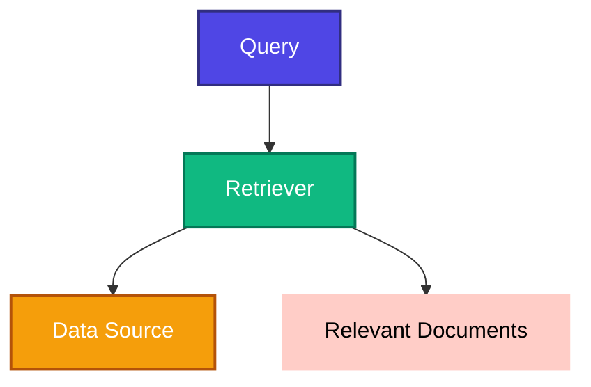

The basic flow is:

```text
User Query
    ↓
Retriever
    ↓
Data Source
    ↓
Relevant Documents
```

---

# Types of Retrievers

Some commonly used retrievers include:

- Wikipedia Retriever
- Vector Store Retriever
- Maximal Marginal Relevance (MMR)
- Multi-Query Retriever
- Contextual Compression Retriever

---

## Wikipedia Retriever

A **Wikipedia Retriever** queries the Wikipedia API to fetch relevant content for a given query.

**How It Works**

1. You provide a query, such as `"Albert Einstein"`.
2. The retriever sends the query to the Wikipedia API.
3. Wikipedia returns relevant articles or content.
4. The retriever converts the retrieved content into LangChain `Document` objects.

📁 [Wikipedia Retriever](../python/04_rag/04_retrievers/wikipedia_retriever.py)

---

# Vector Store Retriever

A **Vector Store Retriever** is one of the most commonly used retrievers in LangChain.

It retrieves documents from a vector store based on **semantic similarity** using vector embeddings.

### How It Works

1. You store documents in a vector store such as **FAISS**, **Chroma**, or **Weaviate**.
2. Each document is converted into a dense vector using an embedding model.
3. When the user enters a query:
   - The query is also converted into a vector.
   - The retriever compares the query vector with the stored document vectors.
   - The most similar documents are retrieved based on the similarity score.

📁 [Vector Store Retriever](../python/04_rag/04_retrievers/vector_store_retriever.py)

---

# Maximal Marginal Relevance (MMR)

**Maximal Marginal Relevance (MMR)** retrieves documents that are both:

- Relevant to the query
- Diverse from one another

A standard similarity-based retriever can return highly similar or repetitive documents.

MMR attempts to reduce this redundancy and provide information covering different aspects of the query.

## Example

Suppose the query is:

> "What are the adverse effects of climate change?"

Available documents:

```text
D1 → Climate change is causing glaciers to melt rapidly in the Arctic region.

D2 → Glaciers in the Arctic are melting at an alarming rate due to rising temperatures.

D3 → Deforestation in the Amazon is accelerating global climate change.

D4 → Climate change is increasing the frequency of wildfires in California.

D5 → Rising sea levels due to climate change threaten coastal cities like Mumbai and New York.
```

A normal similarity retriever might return:

```text
1. D1 → Arctic glaciers melting
2. D2 → Arctic glaciers melting
3. D3 → Deforestation in the Amazon
```

D1 and D2 contain very similar information.

MMR considers both **relevance and diversity**, so it may instead return:

```text
1. D1 → Arctic glaciers melting
2. D4 → Wildfires in California
3. D5 → Rising sea levels in coastal cities
```

This gives the LLM information about different effects rather than several versions of the same effect.

📁 [MMR Retriever](../python/04_rag/04_retrievers/mmr_retriever.py)

---

# Multi-Query Retriever

Sometimes, a single query may not capture all the different ways information is phrased in your documents.

For example:

> **Query:** "How can I stay healthy?"

This query could represent several different questions:

- What should I eat?
- How often should I exercise?
- How can I manage stress?

A simple similarity search may miss relevant documents if they use different terminology instead of the word **"healthy"**.

**How It Works**

1. The retriever takes the original query.
2. An LLM generates multiple alternative versions of the query.
3. Each generated query is used to perform a separate retrieval.
4. The results from all queries are combined.
5. Duplicate results are removed.

```text
Original Query
      ↓
   LLM
      ↓
Multiple Query Variations
      ↓
 ┌────┼────┐
 ↓    ↓    ↓
Q1   Q2   Q3
 ↓    ↓    ↓
Retrieval from Data Source
      ↓
Combine Results
      ↓
Remove Duplicates
      ↓
Relevant Documents
```

The main benefit is that the retriever can search for the same user intent from multiple perspectives.

📁 [Multi Query Retriever](../python/04_rag/04_retrievers/multi_query_retriever.py)

---

# Contextual Compression Retriever

The **Contextual Compression Retriever** reduces the amount of irrelevant information returned from retrieved documents.

Instead of returning an entire document or paragraph, it analyzes the retrieved content in the context of the user's query and keeps only the relevant information.

## Example

> "What is photosynthesis?"

### Retrieved Document

> "The Grand Canyon is a famous natural site. Photosynthesis is how plants convert light into energy. Many tourists visit every year."

Only the sentence about photosynthesis is relevant to the query.

## Problem

A traditional retriever may return the entire paragraph even though:

- Only one sentence is relevant.
- The remaining information is irrelevant.
- Irrelevant content consumes the LLM's context window.
- Excessive irrelevant context can make the final response less focused.

## What Contextual Compression Does

The Contextual Compression Retriever processes the retrieved documents and extracts only the content relevant to the query.

```text
Original Document:

"The Grand Canyon is a famous natural site.

Photosynthesis is how plants convert light into energy.

Many tourists visit every year."

                ↓

      Contextual Compression

                ↓

Relevant Content:

"Photosynthesis is how plants convert light into energy."
```

### Conceptual Flow

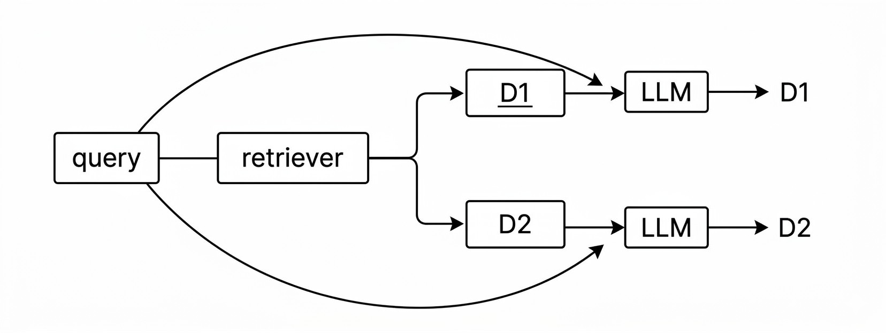

📁 [Contextual Compression Retriever](../python/04_rag/04_retrievers/contextual_compression_retriever.py)

---

---

# Stages of RAG

A complete RAG system can be understood through four major stages:

    1. **Indexing**
    2. **Retrieval**
    3. **Augmentation**
    4. **Generation**

The overall concept is:

```text
                 INDEXING
                    │
                    ▼
             Knowledge Base
                    │
                    ▼
                Retrieval
                    │
                    ▼
              Relevant Context
                    │
                    ▼
Query ─────────► Augmentation
                    │
                    ▼
                  Prompt
                    │
                    ▼
                   LLM
                    │
                    ▼
                Response
```

---

# Indexing

**Indexing** is the process of preparing a knowledge base so that it can be efficiently searched at query time.

The indexing process consists of four major steps:

1. Document Ingestion
2. Text Chunking
3. Embedding Generation
4. Storage in a Vector Store

---

## 1. Document Ingestion

Document ingestion is the process of loading source knowledge into the application.

### Examples

Sources can include:

- PDF reports
- Word documents
- YouTube transcripts
- Blog pages
- GitHub repositories
- Internal wikis
- SQL records
- Scraped webpages

### Tools

LangChain provides various document loaders, including:

- `PyPDFLoader`
- `YoutubeLoader`
- `WebBaseLoader`
- `GitLoader`
- Other specialized loaders

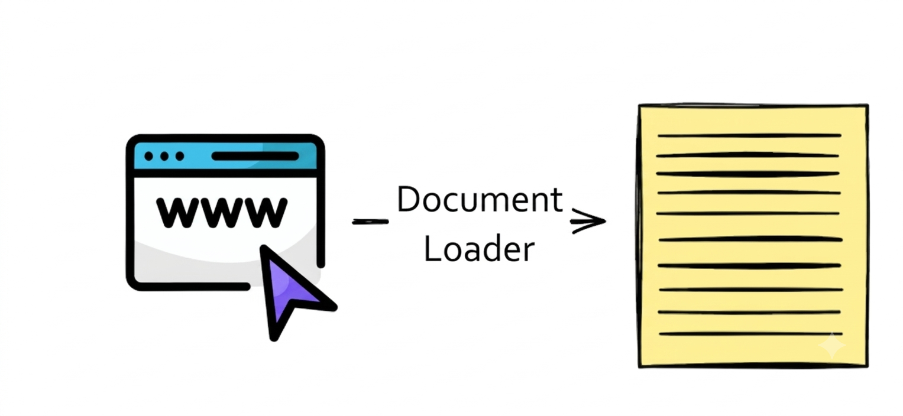

---

# 2. Text Chunking

Text chunking breaks large documents into smaller, semantically meaningful pieces.

### Why Chunk?

Large documents need to be divided because:

- LLMs and embedding models have input/context limitations.
- Smaller chunks are more focused.
- Smaller chunks can improve semantic search.

### Tools

Common LangChain tools include:

- `RecursiveCharacterTextSplitter`
- `MarkdownHeaderTextSplitter`
- `SemanticChunker`

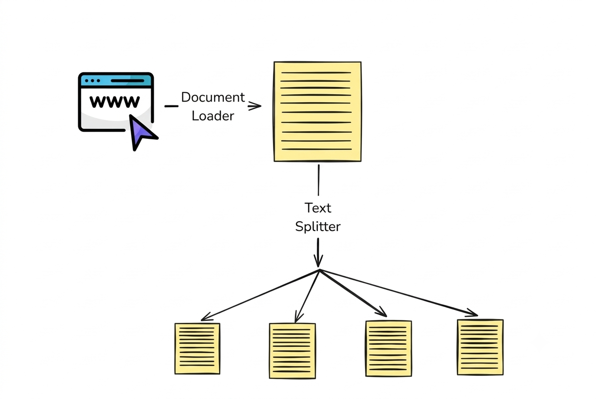

---

# 3. Embedding Generation

Embedding generation converts each text chunk into a **dense vector** that represents its semantic meaning.

### Why Embeddings?

Embeddings allow:

- Similar ideas to be represented by nearby vectors in vector space.
- Fast semantic search.
- Retrieval based on meaning rather than exact keywords.

### Examples of Embedding Models

- `OpenAIEmbeddings`
- `SentenceTransformerEmbeddings`
- `InstructorEmbeddings`

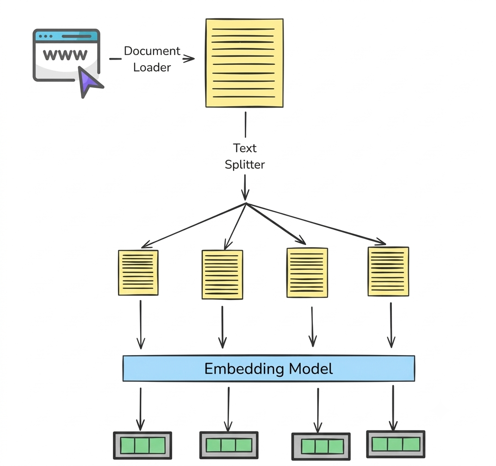

---

# 4. Storage in a Vector Store

The generated vectors are stored along with their original chunk text and metadata.

### Vector Database Options

#### Local

- FAISS
- Chroma

#### Cloud

- Pinecone
- Weaviate
- Milvus
- Qdrant

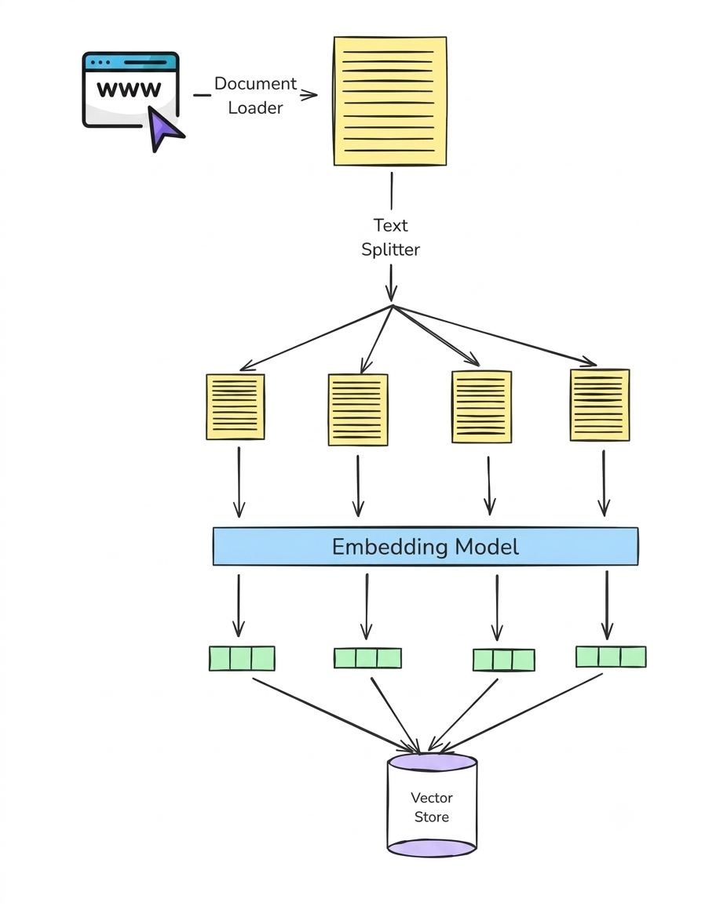

---

# Retrieval

**Retrieval** is the real-time process of finding the most relevant pieces of information from a pre-built index based on the user's question.

The index was created during the **indexing phase**.

A simple way to understand retrieval is:

> "From all the knowledge I have, which 3–5 chunks are most helpful for answering this query?"

For a vector-based RAG system, the process is generally:

Different retrieval strategies can then be used, such as:

- Similarity Search
- MMR
- Multi-Query Retrieval
- Contextual Compression

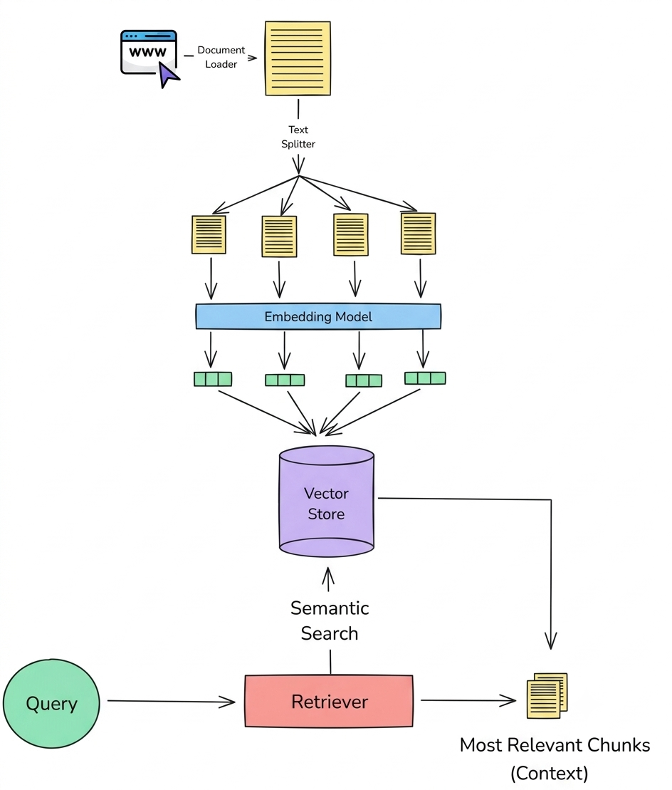

---

# Augmentation

**Augmentation** is the step where the retrieved documents are combined with the user's question to create an enriched prompt for the LLM.

The retrieved information becomes the **context** that the LLM can use when generating the answer.

### Default System Prompt Template

```text
You are a helpful assistant.

Answer the question ONLY from the provided context.

If the context is insufficient, just say you don't know.

{context}

Question: {question}
```

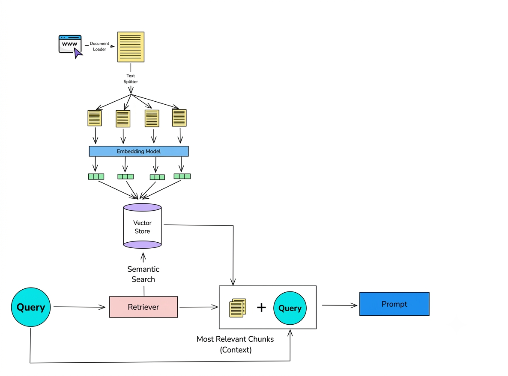

---

# Generation

**Generation** is the final stage of the RAG pipeline.

The Large Language Model receives:

- The user's query
- The retrieved context
- The augmented prompt

The LLM then uses this information to generate the final response.

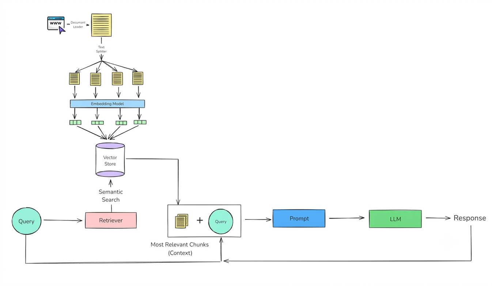
